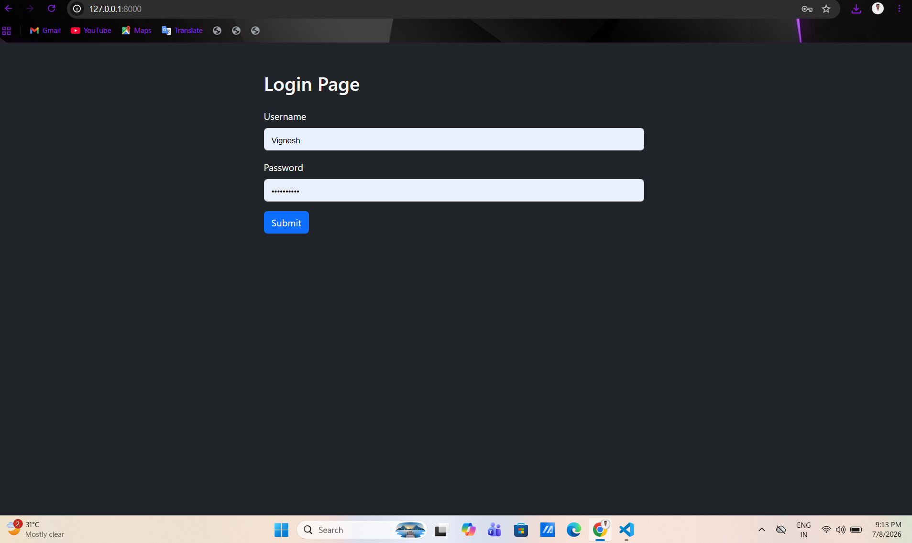
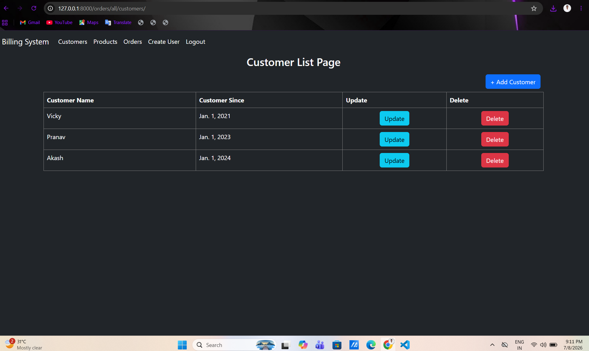
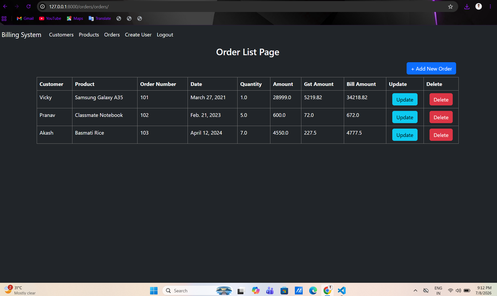
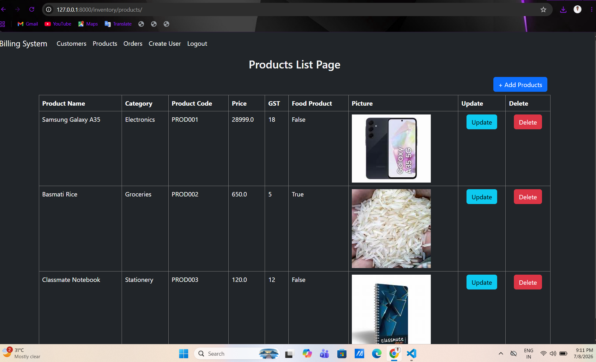

# Inventory Management System

A web-based **Inventory Management System** built using **Django** and **MySQL**. This application helps manage inventory, products, categories, and orders through a user-friendly interface and Django's admin panel.

## Features

- User Authentication
- Inventory Management
- Product Management
- Category Management
- Order Management
- Django Admin Panel
- MySQL Database Integration

## Technologies Used

- Python
- Django
- MySQL
- HTML
- CSS
- Bootstrap

## Project Structure

```
Inventory/
OrderManagement/
authentication/
templates/
static/
manage.py
requirements.txt
```

## Installation

### 1. Clone the repository

```bash
git clone https://github.com/Vicky27032002/inventory-management-system.git
```

### 2. Create a virtual environment

```bash
python -m venv venv
```

### 3. Activate the virtual environment

**Windows**

```bash
venv\Scripts\activate
```

### 4. Install dependencies

```bash
pip install -r requirements.txt
```

### 5. Create a MySQL database

Create a database named:

```
django_series_db
```

Update the database credentials in `settings.py`.

### 6. Apply migrations

```bash
python manage.py migrate
```

### 7. Create a superuser

```bash
python manage.py createsuperuser
```

### 8. Run the development server

```bash
python manage.py runserver
```

Open:

```
http://127.0.0.1:8000/
```

## Screenshots


```
screenshots/
├── login.png
├── customers.png
├── orders.png
├── products.png
```


### Login Page


### Customer Management


### Orders Management


### Products Management



## Author

**Vignesh R**

GitHub: https://github.com/Vicky27032002